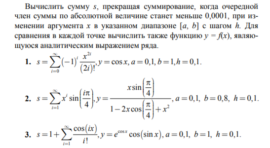

# Задание 1 уровня
1) Вычислить `s = 2 + 5 + 8 + ... + 35`
2) Вычислить `s = 1 + 1/2 + 1/3 + 1/4 + ... + 1/10`
3) Вычислить `s = 2/3 + 4/5 + 6/7 + ... + 112/113`

# Задание 2 уровня
1) Вычислить сумму `s = cos x + (cos 2x)/2^2 + ... + (cos nx)/n^2 + ...` .Суммирование прекратить, когда очередной член суммы по модулю
будет меньше `ε = 0,0001`
2) Определить наибольшее значение сомножителя `n`, для которого произведение `р = 1 · 4 · 7 ·...· n` не превышает `L = 30000`
3) Определить количество членов арифметической прогрессии, сумма которых `s = a + (a + h) + ... + (a + nh)` не превышает заданного числа `р`

# Задание 3 уровня 
> решил картинку вставить

